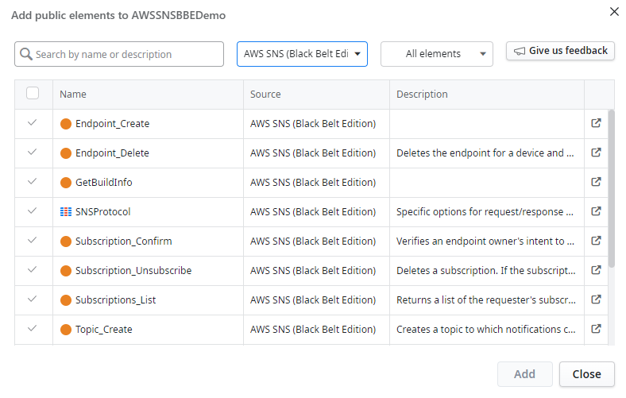
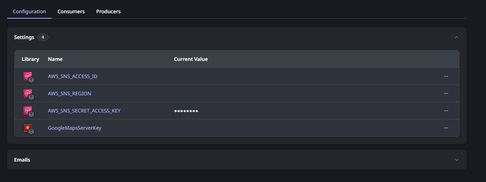
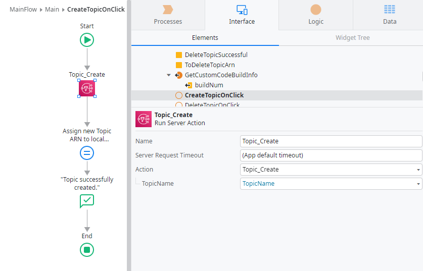

# AWS SNS (Black Belt Edition)

## Introduction

OutSystems Developer Cloud (ODC) is a cloud-native app development platform that provides a modular, scalable environment in which you develop and deploy your apps. With ODC you can build and deploy enterprise-grade, mission-critical apps in weeks. You can build web apps, web portals, mobile apps, and business workflows faster than with traditional development tools. You can then deploy your apps in a scalable, secure, and high-performance environment.

Amazon Simple Notification Service (Amazon SNS) is a managed service that provides message delivery from publishers to subscribers (also known as producers and consumers).  Use a single endpoint for all platforms and send messages directly to users with SMS text messages or mobile push notifications. 

Integrating with SNS is a great way to help you:

1. Modernize and decouple your apps
2. Send messages directly to millions of users
3. Deliver messages on time and only once
4. Scale your workload

This connector has two parts:

1. A custom code extension : AWS_SNS_ExternalLogic
2. A library that uses the underlying custom code extension: AWS SNS (Black Belt Edition)

The connector provides the following functionality (as of now):

1. Endpoint_Create
2. Endpoint_Delete
3. Subscription_Confirm
4. Subscriptions_List
5. Subscription_Unsubscribe
6. Topic_Create
7. Topic_Delete
8. Topic_Publish
9. Topics_List
10. Topic_Subscribe

There is also a operational support API to discover the unique build number for this connector so that any bugs discovered can be reported against this unique build number. The API is

1. GetBuildInfo

## Pre-requisites

To use this component correctly, you should have:

1. A valid set of AWS credentials (as access keys) with permissions to perform the SNS relevant functions 

(For testing purposes, you may AmazonSNSFullAccess, however, you should always limit the permissions to the bare minimum for production use)

## Installation

You can install the connector through [ODC Forge](https://success.outsystems.com/documentation/outsystems_developer_cloud/forge/install_or_update_a_forge_asset/#install-a-forge-asset).

You should install both the custom code extension as well as the AWS SNS (Black Belt Edition) library.

## How to Use

### Add library to your application

Firstly, add the _AWS SNS (Black Belt Edition)_ library to your application as shown below.

Depending whether you want to use all the APIs, you can selectively add the needed APIs (or removed unused ones automatically later).

### Configuration

The _AWS SNS (Black Belt Edition)_ library requires a few settings to be configured in ODC portal for your application which is using the library:

| S/No. | Name of setting | Remarks                                                                  |
| ----- | --------------- | ------------------------------------------------------------------------ |
| 1.    | AWS_SNS_ACCESS_ID   | The IAM user access key ID                        |
| 2.    | AWS_SNS_REGION   | The SNS region of choice                          |
| 3.    | AWS_SNS_SECRET_ACCESS_KEY   | The IAM user access key secret  |

### Example 1: Create a topic

To create a topic in SNS, you must set up the AWS credentials setting in the previous section as well as the region of choice. Drag the server action Topic_Create in your client action as illustrated below.

### Example 2: Delete a topic

To delete a topic in SNS, you must set up the AWS credentials setting in the previous section as well as the region of choice. Drag the server action Topic_Delete in your client action as illustrated below.

## Limitation

1. The maximum payload sent/receive is 5.5 MB

## Found a bug?

Kindly submit your bug report [here](https://github.com/PaulHoOutsystems/odc-rabbitmq-client/issues) and do indicate the build number of the library which you are using too.

## Contact

You can reach out to me via email at paul.ho@outsystems.com
